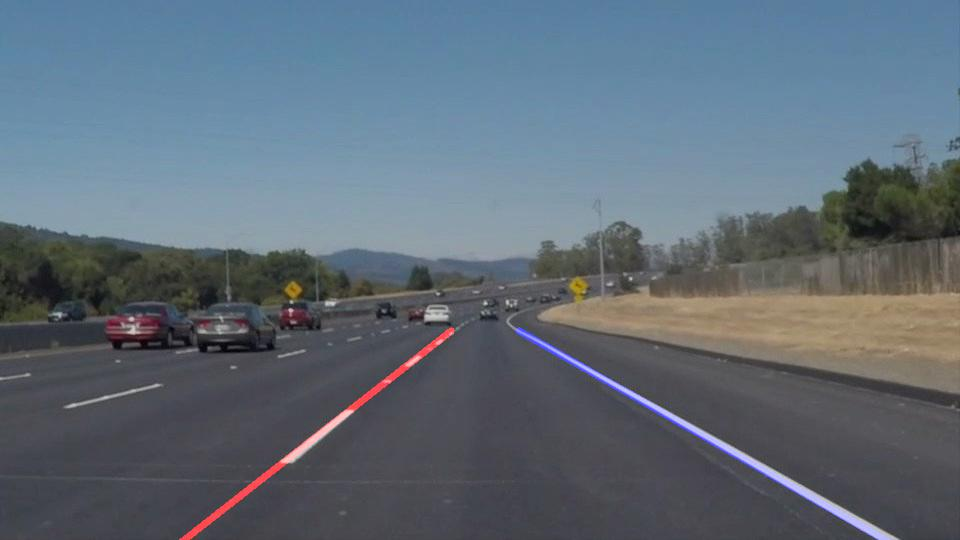
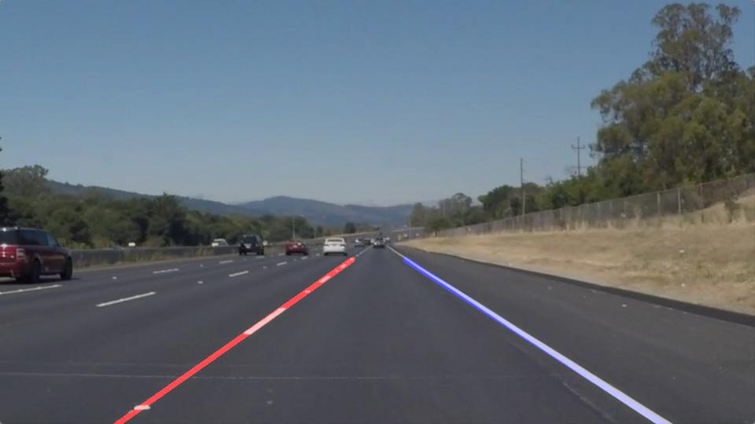
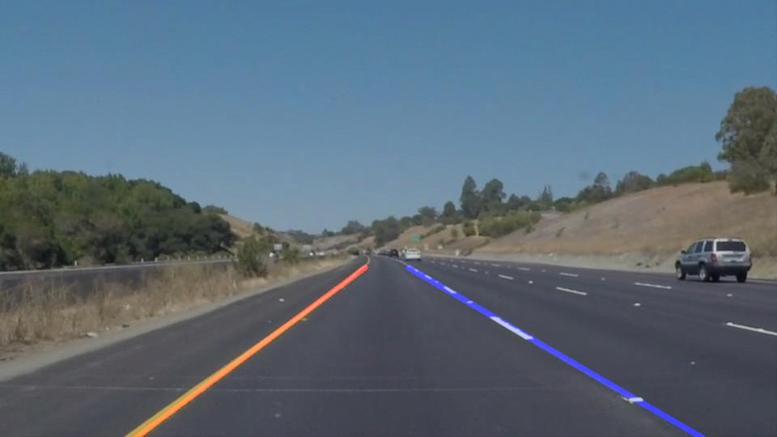
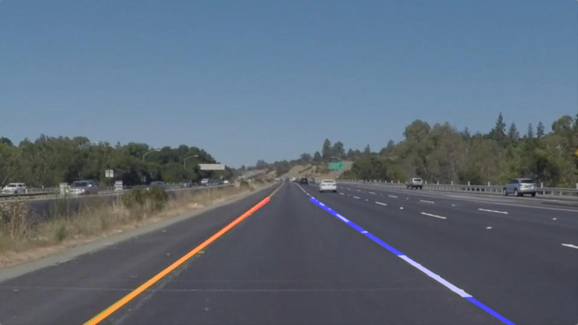

# **Finding Lane Lines on the Road** 

**Finding Lane Lines on the Road**

The goals / steps of this project are the following:
* Make a pipeline that finds lane lines on the road
* Reflect on your work in a written report

---

### Reflection

### 1. Describe your pipeline. As part of the description, explain how you modified the draw_lines() function.

My pipeline consisted of 5 steps. First, I created a yellow and white mask using the image in the HSL domain as the difference between yellow and white pixel values are the most distinct. Then, I unioned these masks together, conerted them to grayscale and created a region of intest mask. Follwing this, I used the `` hough_lines`` and ``draw_lines`` functions to mark the lane lines.

## Test Outputs
### Solid White lane-line
 

### Solid Yellow lane-line
 

### 2. Identify potential shortcomings with your current pipeline

The potential shortcomings would be as follows:
- In a real world scenario, there may be gaps in the lane markings (or no marking at all) on the road.

- When the radius of curvature of the lane line is large (at turnings fo eg.) we wouls detect either no and/or pseudo lines.

- We can detect more or less lines due to occlusions and physical phenomenon that can through the gradient off (like shadows created by passing cars).

### 3. Suggest possible improvements to your pipeline

- Making the lane detection vehicle specific (there would be psedo lane lines created if no markings are detected). 

- The gradients must be constrained to a certain range.

- We could use dynamic programming to remember where the lines were in the previous frame, and correct for errors in the currect frame if they occur (feedback loop). We can do this as there would be no drastic chenge from frame to frame.
